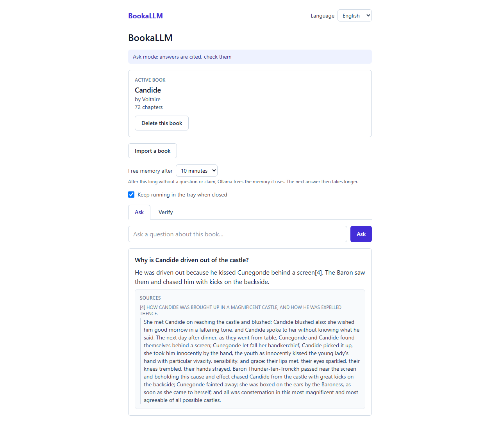
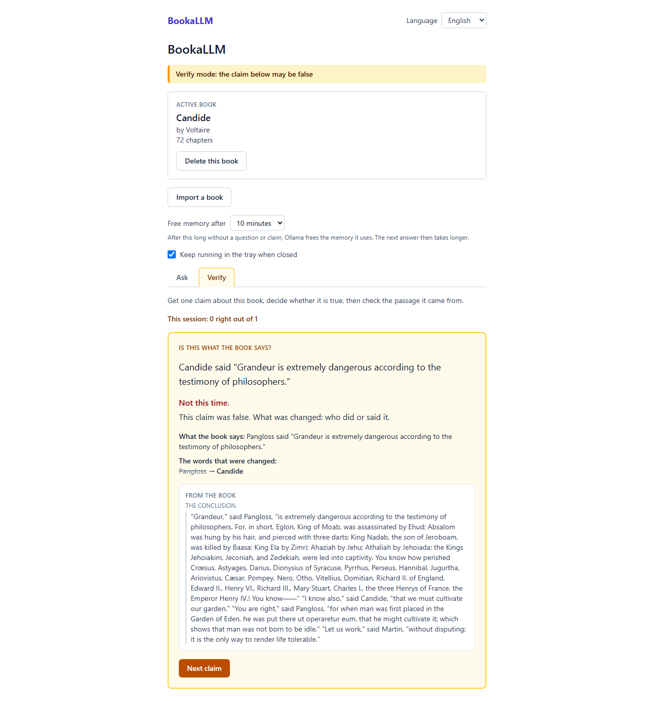
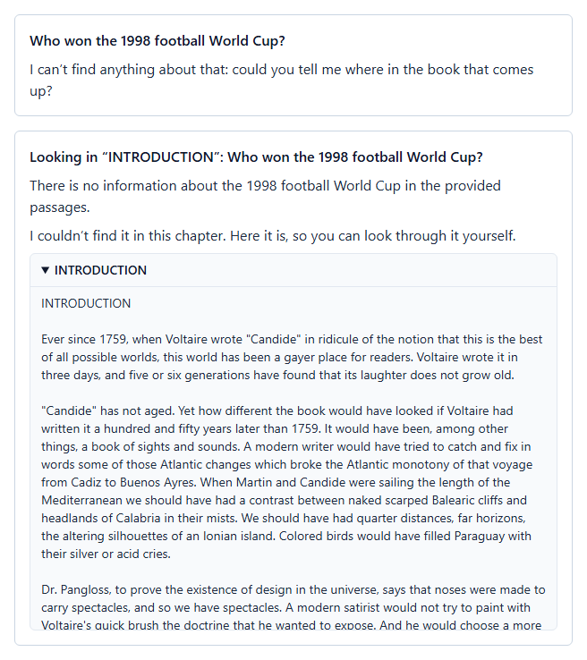

# BookaLLM

**AI makes mistakes. Use them to learn.**

Ask your book questions, and check every answer against the page it came
from.

**BookaLLM is free**: no price, no account, no subscription, and open
source under the MIT license.

It is a study companion for EPUB books that runs entirely on your own
computer, made **mainly for people studying a book**: students, and
anyone who has read a book and wants to test their understanding
against the text. It is not for skipping the reading. Ask "why does
Candide leave the castle?" and you get a short answer in which every
claim points to the exact passage it rests on, so you can read it and
judge for yourself.

AI can misstate what a text says. BookaLLM makes checking part of the
experience: answers are cited, and a second mode deliberately shows you
claims that may be false, so that you get used to going back to the
source.

## What it does

- **Ask mode.** Ask a question in English or French; the answer cites
  the exact passages it uses, and each citation shows the passage
  itself and its chapter. When nothing relevant is found it says so and
  asks where to look. It never claims that the book does not contain
  something.
- **Verify mode.** BookaLLM picks a real passage and states a claim
  about it: sometimes true, sometimes with who did something, or where,
  quietly changed. You decide whether it is true, then see what the book
  says and exactly which words were changed. A session tally keeps
  score.
- **When the search comes up empty.** Point to a chapter, from a list
  or by typing "chapter 7" or "chapitre VII", and BookaLLM looks again in
  that chapter only. If it still cannot answer with a citation, it hands
  you the chapter to read yourself rather than guessing.
- **Everything stays on your computer.** The book, your questions and
  the answers never leave it: the AI runs locally through
  [Ollama](https://ollama.com). BookaLLM never changes, moves or deletes
  your EPUB file.

## Requirements

- **A graphics card is strongly recommended.** Measured on the same
  book: with a GPU, an answer or a claim takes a few seconds; on a
  computer without one it can take several minutes. BookaLLM warns you
  if the AI would run without it.
- **About 8 GB of memory** free while BookaLLM is answering.
- **About 7 GB of disk space** for the AI models, which BookaLLM offers
  to download on first start.

> **Note:** BookaLLM is built and tested on Windows. macOS and Linux are
> not tested yet.

## How to install

1. Download the installer for your system from the
   [latest release](https://github.com/promethee/bookallm/releases/latest):
   - **Windows:** the file ending in `-setup.exe`;
   - **macOS:** the `.dmg` ending in `aarch64` for an Apple chip (M1 or
     later), or in `x64` for an Intel chip;
   - **Linux:** the `.AppImage` (make it executable) or the `.deb`.
2. Run it, then open BookaLLM. The installers are not signed yet, so your
   system asks once to confirm:
   - **Windows** may say "Windows protected your PC": choose "More info",
     then "Run anyway";
   - **macOS**, the first time: right-click BookaLLM, choose Open, then
     Open again.

That is all: BookaLLM guides you through the rest in plain language. It
helps you install Ollama if you do not have it, offers to download the
AI models (only after you agree), and asks for your first book.
Getting to know a book takes a few minutes the first time and is kept
for next time.

The first release is being prepared.

## Where to find free EPUBs

BookaLLM needs DRM-free EPUB files. It recognises protected books and
explains why it cannot open them. These sites offer public-domain books
as free, DRM-free EPUBs:

### In English

- [Project Gutenberg](https://www.gutenberg.org): tens of thousands of
  public-domain books, each with EPUB downloads.
- [Standard Ebooks](https://standardebooks.org/ebooks): public-domain
  books carefully proofread and formatted.

### En français

- [Ebooks libres et gratuits](https://www.ebooksgratuits.com): plus de
  3 000 livres du domaine public, en ePub notamment.
- [Bibebook](https://www.bibebook.com): plus de 1 700 livres
  électroniques libres et gratuits, en EPUB.
- [Wikisource](https://fr.wikisource.org): chaque œuvre peut être
  téléchargée en EPUB (« Télécharger en EPUB »).

## Getting started

BookaLLM works with **one book at a time** for now: the last book you
add is the one you study. Adding another switches to it; deleting it
brings back the previous one.

Once your book is ready, the main screen offers two modes, as tabs.

### Ask mode: check your understanding

**Why:** to get answers you can verify, not answers you have to trust.

**How:** type a question about the book, for example "Why is Candide
driven out of the castle?", and press Ask. The answer marks each claim
with a number like `[4]`; under it, each number shows the exact passage
and its chapter. Read the passage and judge for yourself.

If nothing is found, choose a chapter from the list (or type "chapter
7") and BookaLLM looks there. If it still cannot answer, it shows you
the chapter to read.

### Verify mode: train your eye

**Why:** AI can misstate a book with confidence. Verify mode shows you
claims that may be false on purpose, so that checking becomes a habit.

**How:** press "Give me a claim", read it, and answer True or False.
BookaLLM then reveals whether you were right, shows what the book really
says and which words were changed, and keeps score for the session.

Each question is answered on its own for now. What is planned next is in
the [roadmap](INTENT.md#roadmap).

## License

[MIT](LICENSE).

## How this was built

Built with Claude Opus 5.5 in [Claude Code](https://claude.com/claude-code)
over ten days (2026-09-20 to 2026-09-29). Tokens: about 714,000 in the
longest session; totals and memory were not recorded.

## AI disclaimer

- **The answers come from an AI and can be wrong.** BookaLLM runs a
  local language model that can misread a passage, leave something out
  or state something the book does not say. That is why every answer
  cites its passages: read them before you rely on an answer.
- **Verify mode shows false claims on purpose.** A claim in Verify mode
  may have been changed; only the book decides.
- **Not a substitute for reading.** BookaLLM helps you check your
  understanding of a book you are reading; it does not replace it.
- **Designed by a human, built with AI.** BookaLLM's idea, design and
  decisions are the author's. The code and documentation were written
  with Claude (Anthropic) through Claude Code, and reviewed, tested and
  approved by the author.
